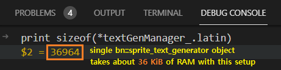

# Symbol★Merged

A puzzle platformer game for the [GBA](https://en.wikipedia.org/wiki/Game_Boy_Advance) where you can merge items(symbols) in hands, and use the superpower of the merged symbol.

  

Supported languages : English, 한국어(Korean)

Currently in early alpha stage.
[You can check out the demo on itch.io](https://copyrat90.itch.io/sym-merged)

## Dependencies

This program uses [Butano](https://github.com/GValiente/butano), which is licensed under zlib license.

## Build

First, make sure the [Butano](https://github.com/GValiente/butano) is set up correctly, with its own dependencies.

And you need to tweak the Butano engine's code a little bit.

1. In file `butano/include/bn_config_sprite_text.h`, change the value of macro constant `BN_CFG_SPRITE_TEXT_MAX_UTF8_CHARACTERS` from `64` to `4096`.
2. In file `butano/include/bn_sprite_font.h`, comment out this line: `BN_ASSERT(! _duplicated_utf8_characters(), "There's duplicated UTF-8 characters");`

**IMPORTANT NOTE : With this tweak, single `bn::sprite_text_generator` object consumes your RAM about 36 KiB!**
(which is too much considering the whole IWRAM is 32 KiB)

**So, you'll ABSOLUTELY want to do this tweak on the Butano code for THIS PROJECT ONLY!**

Lastly, change the path in `Makefile` which points to the directory where `butano.mak` is located,
from `LIBBUTANO   :=  D:/Library/butano/butano` to your own path.

Now, **Run `make -j16` TWICE**; Yes, **_2 times_**.

Due to how the Makefile of the devkitARM works, `game_stage_Wx_Sy.cpp` files
generated by `stage-codegen.py` is **NOT compiled on the first `make -j16` run**,
resulting in `undefined reference to 'sym::game::stage::Get_Wx_Sy()'` linker errors.

So, **You have to run `make -j16` TWICE** to build properly.

## License
Source code is licensed under MIT/Expat license.

License of assets differ from each other, check the individual license on `licenses/asset` folder.
