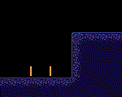
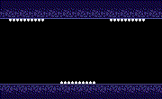

# Symbol★Merged

A puzzle platformer game for the [GBA](https://en.wikipedia.org/wiki/Game_Boy_Advance) where you can merge items(symbols) in hands, and use the superpower of the merged symbol.

  

Supported languages : English, 한국어(Korean)

Currently in early alpha stage.
[You can check out the demo on itch.io](https://copyrat90.itch.io/sym-merged)

## Dependencies

This program uses [Butano](https://github.com/GValiente/butano), which is licensed under the zlib license.

## Build

First, make sure the [Butano](https://github.com/GValiente/butano) is set up correctly, with its own dependencies.

Next, change the path in `Makefile` which points to the directory where `butano.mak` is located,
from `LIBBUTANO   :=  D:/Library/butano/butano` to your own path.

That should do it, now do `make -j16` and see what happens.

## License
Source code is licensed under the MIT/Expat license.

License of assets differ from each other, check the individual license on `licenses/asset` folder.
